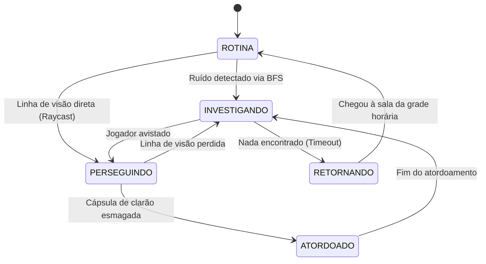

# Computação — Inteligência Artificial e Algoritmos de Perseguição

A inteligência dos Insones combina quatro estruturas algorítmicas canônicas da Computação: **BFS**, **A\***, **Cadeias de Markov** e **Máquinas de Estados Finitas (FSM)**.

---

## 1. Propagação de Som via Busca em Largura (BFS)

Quando Gabriel corre, esbarra em móveis ou arremessa uma pedra, um evento acústico com intensidade inicial $I_0$ é gerado no nó de origem $v_{origem}$.

- **O Algoritmo:** Uma Busca em Largura (BFS) expande a onda sonora camada por camada pelos nós vizinhos do grafo $G$.
- **Atenuação por Aresta:** A intensidade sonora decai a cada nó percorrido conforme o peso da aresta e o tipo de barreira:
  $$I_{vizinho} = I_{atual} - (\text{peso\_aresta} \times \alpha_{parede})$$
- **Detecção:** Se o Insone estiver posicionado em um nó onde $I_{no} \ge \text{limiar\_audicao}$, seu estado muda para *Investigando*, e o nó de maior intensidade acústica vira seu destino imediato.

---

## 2. Perseguição Ativa via Algoritmo A\* (A-Star)

Quando a linha de visão é confirmada ou um ruído alto denuncia a posição de Gabriel, o Insone engaja em perseguição direta calculando o caminho ótimo até a última posição conhecida do jogador:

- **Função de Custo:**
  $$f(n) = g(n) + h(n)$$
  - $g(n)$: Custo real acumulado no grafo desde a posição do Insone até o nó $n$.
  - $h(n)$: Heurística admissível (distância euclidiana 2D em linha reta entre o nó $n$ e o nó do jogador).
- **Recálculo em Tempo Real:** O caminho é recalculado periodicamente (ex.: a cada 0.5s) para se adaptar caso Gabriel mude de rota ou atravesse portas e frestas.

---

## 3. Comportamento Errante via Cadeias de Markov

Quando um Insone está fora da rotina e não detectou o jogador, ele não se move de forma totalmente aleatória nem segue rotas puramente estáticas. Seu movimento é modelado como um processo estocástico de Markov:

- **Espaço de Estados:** O conjunto de salas adjacentes $S = \{s_1, s_2, \dots, s_m\}$.
- **Matriz de Transição estocástica ($P_{ij}$):** A probabilidade de transitar da sala $i$ para a sala vizinha $j$:
  $$P_{ij} = \frac{e^{\beta \cdot \text{atratividade}(j)}}{\sum_{k \in \text{Vizinhos}(i)} e^{\beta \cdot \text{atratividade}(k)}}$$
- **Atratividade:** Salas com resquícios humanos, portas abertas recentemente ou onde o jogador foi visto no passado possuem maior probabilidade de transição, aumentando a sensação de perigo inteligente (modelo similar à IA de FNAF formalizada).

---

## 4. Máquina de Estados Finita (FSM)

Cada Insone opera sob uma FSM com transições rigorosas:

- **ROTINA:** Executa a tarefa da semana de provas conforme a grade horária.
- **INVESTIGANDO:** Move-se até o nó onde o som ou movimento suspeito foi registrado.
- **PERSEGUINDO:** Move-se na velocidade máxima calculada via $A^*$ em perseguição direta.
- **ATORDOADO:** Paralisado por 3 a 5 segundos após a detonação de uma cápsula de clarão.
- **RETORNANDO:** Caminha de volta à sala original prevista pela coloração de horários.
