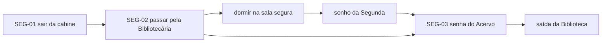

# Fases e puzzles

Tudo que é **específico de cada fase** fica aqui: salas, Insones, puzzles, sonho e o que o jogador descobre. O GDD (`gdd.md`, item 4) descreve o campus em geral; este arquivo é o detalhamento de uma fase de cada vez.

- **Dono:** papel 4 (Roteiro e fases). Qualquer um pode propor mudança por PR.
- **O que tem ⚠️ é proposta**, não decisão. Quando o grupo fechar, tire o ⚠️ e registre em `decisoes.md`.
- Se algo aqui contradizer `decisoes.md`, vale `decisoes.md`.

---

## Como os puzzles são organizados

### 1. Todo puzzle é uma aresta trancada do grafo

O campus já é um grafo (salas = nós, passagens = arestas). Um puzzle **não é um minijogo solto**: é uma passagem fechada. Resolver o puzzle liga uma **flag** do mundo, e a flag abre a aresta.

```
[Salão da Biblioteca] --(porta do Acervo: precisa de flag acervo_aberto)--> [Acervo]
```

Isso liga os puzzles direto ao sistema de grafos (papel 1) e ao dicionário de flags (estruturas de dados), sem código especial para cada puzzle.

### 2. A regra do jogo: a pista vem do sonho, a solução é no presente

Quase todo puzzle segue o mesmo formato, que é o gancho do VIGÍLIA:

| Etapa | Onde acontece | Exemplo |
|---|---|---|
| **Obstáculo** | presente, nas ruínas | cadeado com senha de 4 dígitos |
| **Pista** | sonho (ou uma marca nas ruínas) | no sonho, alguém fala a senha ou ela aparece num quadro |
| **Solução** | presente, com Insones por perto | voltar à porta e digitar sem ser ouvido |

Puzzles só com pista das ruínas também valem, mas o sonho deve ser a fonte principal. Evitem puzzle cuja pista esteja na mesma sala do obstáculo — tira a razão de explorar e de dormir.

### 3. Tipos de puzzle (para não repetir)

| Tipo | O que é | Onde combina |
|---|---|---|
| **Senha** | código, combinação, número de sala | cadeados, cofre do NAMI e da Reitoria |
| **Horário** | só dá para passar quando o Insone está em outra sala da grade | Blocos de aula (Professor) |
| **Distração** | fazer barulho num lugar para liberar outro (usa o BFS do som) | Biblioteca, Centro de Convivência |
| **Ambiente** | empurrar estante, subir por árvore, derrubar algo para criar passagem (cria aresta nova) | qualquer área |
| **Luz** | revelar algo só visível com fungo, ou apagar a luz para passar pelo Vigia | Espaço Cultural, NAMI |
| **Observação** | ler tracinhos, anéis da árvore, relíquias, e deduzir um número | Biblioteca, Blocos de aula |

### 4. Ficha de cada puzzle

Cada puzzle tem um ID `FASE-NN` (ex.: `SEG-01`) e uma ficha curta na seção da fase:

```
### SEG-01 — Nome do puzzle
- Tipo: senha / horário / distração / ambiente / luz / observação
- Onde: sala onde está o obstáculo
- Obstáculo: o que impede o jogador
- Pista: onde está a pista (sonho X, parede da sala Y)
- Solução: o que o jogador faz
- Libera: flag que liga + aresta/sala/item que abre
- Depende de: IDs de puzzles ou flags que precisam vir antes
- Perigo: qual Insone ameaça durante o puzzle
- Status: ideia / aprovado / implementado
```

O campo **Libera** usa o mesmo nome de flag que vai para o código (`snake_case`), para o papel 1 e o papel 2 usarem a mesma lista.

### 5. Mapa de dependências

Cada fase tem um diagrama de "o que precisa vir antes do quê". Ele mostra na hora se tem puzzle sem pista, pista que não leva a nada ou fase que trava. O GitHub desenha diagramas `mermaid` direto no arquivo.

Esse mapa é um **grafo dirigido sem ciclos**. Dá para apresentar na disciplina: a ordem em que o jogador consegue resolver tudo é uma **ordenação topológica** dele, e um ciclo no mapa é um bug de design (o jogo trava).

---

## Resumo das fases

| Dia | Área | Insones ativos | Descoberta principal | Status |
|---|---|---|---|---|
| Segunda | Biblioteca | Bibliotecária, Rafa | Ele dormiu muito; as pessoas ainda estão aqui | em roteiro (Sprint 1) |
| Terça | Blocos de aula | Professor, Vigia, Rafa | Os Insones seguem a grade; os tracinhos contam séculos | ideia |
| Quarta | Centro de Convivência e Espaço Cultural | Calouros, Vigia, Rafa | Houve uma pesquisa com voluntários | ideia |
| Quinta | NAMI | Pesquisadora, Vigia, Rafa | VIGÍLIA-7, os testes e o nome dele na lista | ideia |
| Sexta | Reitoria e portão | todos | Quanto tempo passou e o que houve com o mundo | ideia |

---

## Segunda — Biblioteca

**Função:** tutorial e primeiro contato. É o **marco do Sprint 4**: tem que funcionar do começo ao fim sozinha. Por isso é a fase mais detalhada.

- **Objetivo do jogador:** sair da Biblioteca.
- **Descoberta:** ele dormiu muito tempo; as pessoas ainda estão aqui, mas mudaram.
- **Insones:** Bibliotecária (audição: barulho na Biblioteca atrai ela na hora). ⚠️ Rafa só aparece de relance, sem perseguir.
- **Mecânicas ensinadas, nesta ordem:** andar → examinar → pegar fungo (luz) → esconder-se → distrair → dormir e sonhar.

### Salas (nós do grafo) ⚠️

| ID | Sala | Esconderijos | Observação |
|---|---|---|---|
| `bib_cabine` | Cabine de estudo onde Gabriel acorda | cabine | início do jogo |
| `bib_salao` | Salão com a árvore | estantes caídas | rota da Bibliotecária |
| `bib_acervo` | Acervo | armário | trancado no começo |
| `bib_sala_segura` | Sala fechada para dormir | — | primeiro save |
| `bib_saida` | Saída / catraca | — | fim da fase |

### Puzzles ⚠️

#### SEG-01 — Sair da cabine
- Tipo: ambiente
- Onde: `bib_cabine`
- Obstáculo: estante caída bloqueando a saída
- Pista: nenhuma (tutorial de examinar e empurrar)
- Solução: empurrar a estante devagar; empurrar rápido faz barulho
- Libera: `cabine_livre` → aresta `bib_cabine`–`bib_salao`
- Depende de: —
- Perigo: nenhum (primeiro som da Bibliotecária ao fundo)
- Status: ideia

#### SEG-02 — Passar pela Bibliotecária
- Tipo: distração
- Onde: `bib_salao`
- Obstáculo: a Bibliotecária arrumando a estante na frente do caminho
- Pista: ela reage a qualquer barulho (o jogador descobre ao ser caçado ou ao ver um objeto cair)
- Solução: jogar um objeto longe para atraí-la, passar enquanto ela investiga
- Libera: `salao_atravessado` → acesso a `bib_sala_segura`
- Depende de: SEG-01
- Perigo: Bibliotecária
- Status: ideia

#### SEG-03 — Senha do Acervo
- Tipo: senha
- Onde: `bib_acervo`
- Obstáculo: porta do Acervo com cadeado de números
- Pista: **primeiro sonho** — Rafa comenta o código do armário/acervo, ou ele está num aviso no balcão
- Solução: voltar do sonho e digitar a senha
- Libera: `acervo_aberto` → aresta `bib_salao`–`bib_acervo`, item que abre a saída
- Depende de: SEG-02, `sonho_segunda_visto`
- Perigo: Bibliotecária (digitar faz barulho baixo)
- Status: ideia

### Sonho da Segunda ⚠️
- **Quando:** primeira vez que dorme em `bib_sala_segura`.
- **Cena:** a Biblioteca na noite antes de tudo; Rafa estudando com Gabriel.
- **O jogador leva de volta:** a senha do Acervo (SEG-03) e a primeira menção à pesquisa com voluntários.
- Roteiro detalhado: `roteiro/sonho_segunda.md` (a criar).

### Dependências



---

## Terça — Blocos de aula

- **Objetivo do jogador:** ⚠️ a definir
- **Descoberta:** os Insones seguem a grade da semana de provas; os tracinhos nas paredes contam séculos.
- **Insones:** Professor (troca de sala conforme a grade), Vigia, Rafa.
- **Tipo de puzzle dominante:** horário — o jogador usa a grade aprendida no sonho para saber quando cada sala está vazia.
- **Ideias soltas:** ⚠️ contar tracinhos para chegar a um número; quadro de horário no sonho.

### Salas
_A definir._

### Puzzles
_A definir._

### Sonho da Terça
_A definir._

---

## Quarta — Centro de Convivência e Espaço Cultural

- **Objetivo do jogador:** ⚠️ a definir
- **Descoberta:** havia uma pesquisa com voluntários naquela semana.
- **Insones:** Calouros (em grupo), Vigia, Rafa.
- **Tipo de puzzle dominante:** distração (Centro de Convivência) e luz/visual (Espaço Cultural).
- **Ideias soltas:** ⚠️ cartaz *"Durma menos. Renda mais."*; cápsula do tempo.

### Salas
_A definir._

### Puzzles
_A definir._

### Sonho da Quarta
_A definir._

---

## Quinta — NAMI

- **Objetivo do jogador:** ⚠️ a definir
- **Descoberta:** o VIGÍLIA-7, os testes, a lista de voluntários e o nome de Gabriel nela.
- **Insones:** Pesquisadora, Vigia, Rafa.
- **Tipo de puzzle dominante:** senha (cofre) e luz (andar alagado, escuro).
- **Ideias soltas:** ⚠️ as palavras soltas da Pesquisadora só fazem sentido depois dos sonhos.

### Salas
_A definir._

### Puzzles
_A definir._

### Sonho da Quinta
_A definir._

---

## Sexta — Reitoria e portão

- **Objetivo do jogador:** chegar ao portão principal e escolher o final.
- **Descoberta:** quanto tempo passou de verdade e o que aconteceu com o mundo.
- **Insones:** todos.
- **Finais:** sair sozinho / fazer o campus dormir. As opções dependem das flags ligadas ao longo do jogo. ⚠️ Definir quais flags liberam cada final.

### Salas
_A definir._

### Puzzles
_A definir._

### Sonho da Sexta
_A definir._
