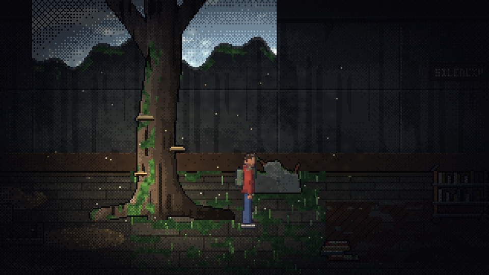
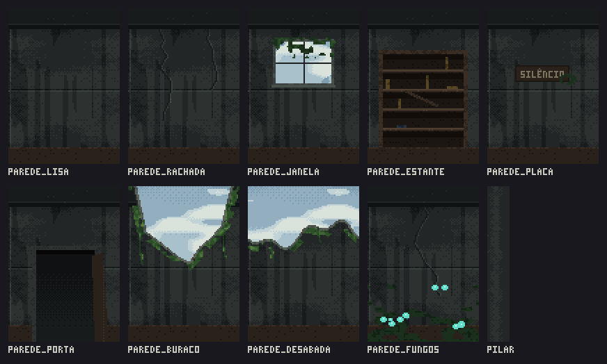
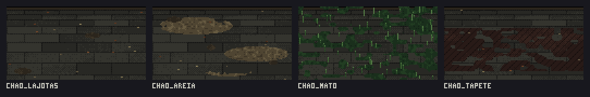
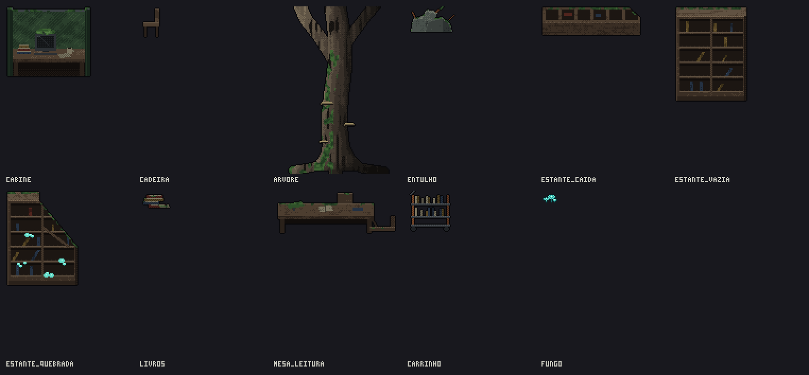

# Guia: montar uma sala com o kit de cenário

Este guia é para quem vai montar salas do mapa (papel 4, mas serve para todo mundo). Você não precisa desenhar nada: o **kit de cenário** tem pedaços de parede, de chão, objetos, luzes e efeitos, todos no estilo da Biblioteca (*FNAF: Into the Pit*). Você monta a sala arrastando as peças no Godot.



A sala de exemplo (`cenas/salas/sala_exemplo.tscn`) foi montada só com peças do kit. Abra no Godot para ver como ficou e use como modelo.

---

## 1. Como uma sala funciona

A sala é vista de lado, mas o chão tem profundidade (2.5D). O Gabriel anda para os lados e também para o fundo e para a frente.

```
 y = 0   ┌──────────────────────────────────────────────┐
         │  PAREDES (peças de 80 px)  ← céu aparece nos  │
         │                              buracos e janelas│
 y = 112 ├──────────────────────────────────────────────┤ ← a parede acaba aqui
         │  CHÃO (peças de 128 px)                        │
         │   ░░░░ faixa onde os pés do Gabriel andam ░░░░ │ ← entre chao_fundo e chao_frente
 y = 180 └──────────────────────────────────────────────┘
         x = 0                                    x = largura
```

- A tela do jogo tem **320 × 180** pixels. Uma sala tem 180 de altura e a largura que você quiser (use múltiplos de 80).
- **Quem está mais embaixo na tela aparece na frente.** O Godot faz isso sozinho no nó `Objetos` (y-sort), pelo **pé** de cada coisa. Por isso todo objeto do kit tem a origem no pé.
- **Só os pés colidem.** Cada objeto tem uma "pegada", um retângulo baixo no chão. O Gabriel pode passar com a cabeça na frente de uma estante, mas os pés dele esbarram na base dela.

## 2. Criar a sala

1. No Godot, menu **Cena → Nova Cena Herdada...** (*Scene → New Inherited Scene...* com o Godot em inglês) e escolha `cenas/salas/modelo_sala.tscn`.
   - "Herdada" quer dizer que a sala nova começa igual ao modelo e continua ligada a ele: se alguém melhorar o modelo (a vinheta, a luz, o Gabriel), sua sala recebe a melhoria.
2. Salve em `cenas/salas/<nome_da_sala>.tscn` (snake_case, sem acento. Ex.: `bloco_d_corredor.tscn`).
3. Clique na raiz da cena e, no **Inspetor**, preencha:

| Campo | O que é |
|---|---|
| `id` | nome da sala no grafo do campus, igual ao nome do arquivo (ex.: `bloco_d_corredor`) |
| `largura` | largura da sala em pixels, múltiplo de 80 (960 = 3 telas) |
| `chao_fundo` / `chao_frente` | até onde os pés do Gabriel vão, para o fundo e para a frente (padrão: 120 e 176) |
| `margem_lados` | quanto o Gabriel para antes da parede da esquerda e da direita |

No editor aparecem **guias** que não aparecem no jogo: o retângulo **amarelo** é a sala, as linhas amarelas fracas marcam cada tela de 320 px, e a faixa **azul** é onde o Gabriel anda. A sala cria sozinha as paredes invisíveis e limita a câmera: você não precisa fazer isso.

## 3. Ligar a grade (para as peças encaixarem)

No topo da tela 2D, clique nos **três pontinhos ao lado do ímã → Configurar Encaixe...** (*Configure Snap...* em inglês):

- **Passo da grade:** `16` × `4` (as paredes e o chão caem certinho; objetos podem ficar em qualquer múltiplo de 4)
- Ligue o **ímã** (Usar Snap de Grade) enquanto coloca paredes e chão.

## 4. Montar

Arraste as cenas do painel **Sistema de Arquivos** para dentro do nó certo (arraste para cima do nó na árvore de cena, ou selecione o nó e arraste para a tela).

| O quê | De onde (`cenas/cenario/`) | Para dentro do nó | Posição |
|---|---|---|---|
| Paredes | `paredes/*.tscn` | `Paredes` | y = **0**, x = 0, 80, 160, ... |
| Pilar das pontas | `paredes/pilar.tscn` | `Paredes` | x = 0 e x = largura − 16, **por último** (fica por cima) |
| Chão | `chao/*.tscn` | `Chao` | y = **0**, x = 0, 128, 256, ... |
| Objetos | `objetos/*.tscn` | `Objetos` | o ponto que você clica é o **pé**: coloque dentro da faixa azul |
| Luzes | `luzes/*.tscn` | `Luzes` | em cima de onde a luz nasce |
| Raios de sol e poeira | `efeitos/*.tscn` | `Efeitos` | embaixo de um buraco do teto |

Dicas:

- **Paredes cobrem a sala toda:** `largura / 80` peças lado a lado. O chão também: `largura / 128` peças, arredondando para cima (a última pode sobrar para fora, a câmera não mostra).
- **Espelhar um objeto:** selecione e marque **`espelhado`** no Inspetor. Duas estantes iguais, uma espelhada, já parecem diferentes.
- **Não use Escala** nos objetos nem nas peças: pixel art esticada fica feia. Para variar tamanho de luz, aí sim, use a escala da luz.
- **Buraco no teto:** a `parede_buraco` é um buraco sozinho. A `parede_desabada` encaixa com ela mesma: duas ou três seguidas fazem um buraco comprido. Embaixo do buraco, coloque `luz_sol`, `raios_de_sol` e `poeira`, e um chão com `chao_areia` ou `chao_mato` (a terra e o mato entram por onde o sol entra).
- **Cantos escuros:** `parede_fungos` + objetos `fungo` + `luz_fungo`. É onde a tensão sobe: o Gabriel vira quase uma silhueta.
- **Onde o Gabriel começa:** mova o nó `Objetos/Gabriel`.

## 5. Testar

Com a sala aberta, aperte **F6** (rodar a cena atual). Ande com **A/D** e **W/S**, corra com **Shift**. Confira:

- o Gabriel passa **atrás** dos objetos quando está mais para o fundo e **na frente** quando está mais para a frente;
- ele não atravessa as bases dos objetos nem sai da faixa de chão;
- a câmera não mostra nada fora da sala (se mostrar, confira a `largura`).

## 6. Catálogo do kit

Todas as imagens ficam em `assets/sprites/cenario/`, e as cenas prontas para arrastar, em `cenas/cenario/`.

### Paredes (80 × 112 px; o pilar tem 16)



| Peça | Uso |
|---|---|
| `parede_lisa` | concreto manchado, a parede "neutra" |
| `parede_rachada` | concreto com rachaduras |
| `parede_janela` | janela com vidro quebrado e trepadeira (o céu aparece) |
| `parede_estante` | estante embutida, vazia |
| `parede_placa` | placa "SILÊNCIO" |
| `parede_porta` | porta para outra sala (vão escuro, folha caída) |
| `parede_buraco` | um buraco no teto, sozinho |
| `parede_desabada` | teto caído de ponta a ponta; encaixa com ela mesma |
| `parede_fungos` | canto úmido com musgo e fungos |
| `pilar` | acabamento das pontas da sala |

### Chão (128 × 68 px)



| Peça | Uso |
|---|---|
| `chao_lajotas` | lajotas com folhas secas |
| `chao_areia` | montes de areia e lajotas faltando (embaixo de buracos) |
| `chao_mato` | musgo e mato (onde bate sol) |
| `chao_tapete` | tapete podre; encaixa com ele mesmo |

### Objetos (com pegada e y-sort)



`cabine`, `cadeira`, `arvore`, `entulho`, `estante_caida`, `estante_vazia`, `estante_quebrada`, `livros`, `mesa_leitura`, `carrinho`, `fungo` (o `fungo` já vem com a luz fria dele).

### Luzes e efeitos

| Cena | O que é |
|---|---|
| `luzes/luz_sol.tscn` | luz quente do sol (use a escala para o tamanho) |
| `luzes/luz_fria.tscn` | luz fria e fraca: janelas, luz rebatida |
| `luzes/luz_fungo.tscn` | brilho ciano que "respira" (fungos pintados na parede) |
| `efeitos/raios_de_sol.tscn` | faixas de luz entrando pelo teto; ajuste `origem` no material |
| `efeitos/poeira.tscn` | poeira flutuando na luz |
| `ceu.tscn` | céu e mata lá fora, com paralaxe (já está no modelo) |

O modelo de sala já traz a **escuridão** geral (`Escuridao`, um CanvasModulate), a **vinheta** e a **tela preta de entrada**. Se a sala ficar escura demais ou clara demais, mude a cor da `Escuridao`.

---

## Para quem mexe na arte (papéis 1 e 3)

As peças não são desenhadas à mão: saem de scripts Python (só precisam de `numpy`).

- `assets/modelagem/cenario/gerar_kit.py` → paredes, chão, céu e as imagens do catálogo deste guia.
- `assets/modelagem/salas/biblioteca/gerar_biblioteca.py` → os objetos, a textura das luzes e a Biblioteca inteira (que tem fundo e chão pintados sob medida, não modulares).

Para criar uma peça nova: escreva a função no script, adicione no dicionário (`PAREDES`, `CHAOS` ou `FUNCOES_OBJETOS`), rode o script, abra o Godot para gerar o `.import` e crie a cena da peça em `cenas/cenario/` copiando uma parecida. Objeto novo precisa do offset (o script imprime "pé em ...") e do tamanho da pegada.

**Regras para a peça encaixar:** parede com 80 px de largura e 112 de altura; chão com 128 × 68; use o `ruido_ciclico` (e não o `ruido`) para a textura dar a volta sem emenda. As explicações estão nos comentários do `gerar_kit.py`.

**Ainda não existe no kit:** peças de primeiro plano (silhuetas escuras por cima do Gabriel, como a copa e os cipós da Biblioteca) e objetos de outras áreas (carteiras, quadro, catraca...). Entram aqui conforme as salas forem sendo montadas.
