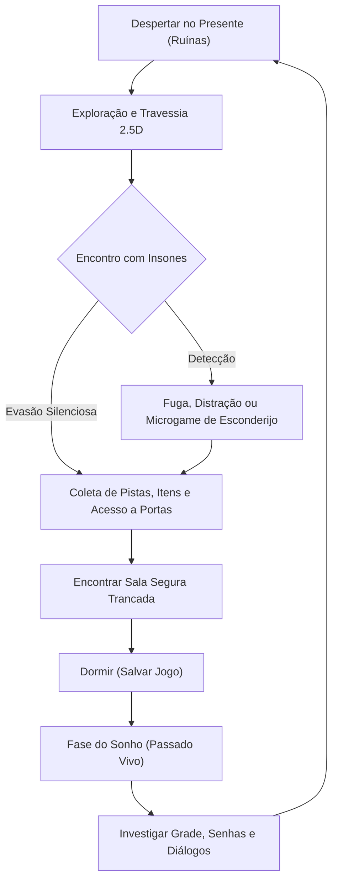

# Mecânicas — Visão Geral e Core Loop

Esta seção detalha todas as regras sistêmicas de jogabilidade de *Projeto The Game*, cobrindo locomoção, sobrevivência, iluminação, furtividade e a mecânica central do sono/sonhos.

---

## 🔄 O Loop Principal de Gameplay (Core Loop)

1. **Explorar Ruínas no Presente:** Navegar pelo campus desabado, recolhendo fungos bioluminescentes, relíquias e itens-chave.
2. **Evitar e Sobreviver aos Insones:** Usar passos lentos, esconderijos com microgames interativos, gestão de luz e arremesso de objetos de distração.
3. **Alcançar Sala Segura:** Localizar áreas estruturalmente intactas com trancas internas.
4. **Dormir para Salvar:** Salvar o progresso e transitar para a dimensão do sonho.
5. **Investigar o Passado:** Conversar com personagens normais (Rafa, alunos), ler quadros de avisos e aprender a grade horária e códigos que abrem caminhos no presente.

---

## 📂 Detalhamento dos Módulos

- **[`movimentacao_e_terreno.md`](movimentacao_e_terreno.md):** Controles de locomoção, corrida, gestão de estamina, ruído de passos e navegação vertical/obstáculos.
- **[`furtividade_e_esconderijos.md`](furtividade_e_esconderijos.md):** Tipos de esconderijos (armários, cabines, raízes), microgames de tensão (respiração, imobilidade) e distrações.
- **[`iluminacao_e_fungos.md`](iluminacao_e_fungos.md):** Gestão de iluminação com pote de fungos, decaimento biológico e cápsulas de clarão atordoadoras.
- **[`itens_e_inventario.md`](itens_e_inventario.md):** Pegar, guardar, equipar e usar itens: inventário em grade (matriz), espaços de gadget e o pote de fungos.
- **[`sono_e_sonhos.md`](sono_e_sonhos.md):** Arquitetura do sistema de save game e jogabilidade investigativa nos sonhos.
